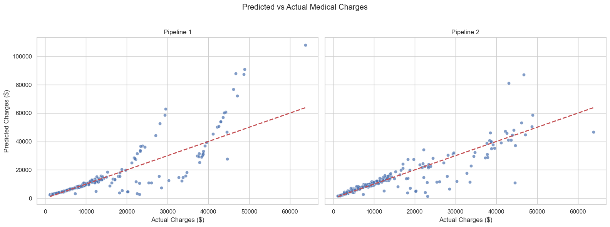

# Beaderstadt Final Project: Regression Analysis
> My personalized Submission: GitHub Repository with Jupyter Notebook and Peer Review.

## Project Overview
In this project, I use the Kaggle Medical Costs Dataset to explore factors like age, lifestyle, and region to see which features have the biggest impact on charges. I’ll walk through data exploration, feature engineering, and modeling with both linear and polynomial regression. Then, I’ll compare model performance and visualize predictions in actual dollar amounts to connect the results to real world impact.

[Click here for my notebook file](https://github.com/abeaderstadt/ml_regression_beaderstadt/blob/main/regression_beaderstadt.ipynb)<br>
[Click here for my peer review file](https://github.com/abeaderstadt/ml_regression_beaderstadt/blob/main/peer_review.md)<br>

---

## Key Steps in This Project

## 1. Import and Inspect the Data
- Loaded the [Medical Costs Dataset](https://www.kaggle.com/datasets/mirichoi0218/insurance) from Kaggle.
- Inspected the dataset using `.info()`, `.head()`.
- Check for missing values and display summary statistics.

  - **Insights:**
    - There were 1,338 instances and 7 features.
    - The target variable is `charges`.

---

## 2. Data Exploration and Preparation

### 2.1 Explore data patterns and distributions
- The features in this dataset are a mix of categorical and numeric.
- Used histograms for the numberic, boxplots to check for outliers, and countplots to explore feature distributions.
- Explored feature importance with a heatmap, boxplot, and scatter plot.

### 2.2 Handle missing values and clean data
- Transformed outliers for `charges` to reduce skew.
- Converted the categorical features to numerical using one-hot encoding.
- Then converted the boolean columns created by one-hot encoding to integers to prepare for scaling.

### 2.3 Feature selection and engineering
- Created a new feature, `smoker_bmi`.
- Scaled numeric predictors.

  - **Rationale:**
    - `smoker_bmi` to capture the combined effect of smoking and BMI.
    - Scaled to prepare for future pipelines and modeling.

---

## 3. Feature Selection and Target Definition

### 3.1 Choose features and target
**Input features:**
- `age`, `bmi`, `children`, `sex_male`, `smoker_yes`, `region_northwest`, `region_southeast`, `region_southwest`, `smoker_bmi`

**Target variable:**
- `charges_log` (i'm modeling on the transformed target)


**Reasoning:**  
- These features were selected because they all relate directly to medical costs. The `smoker_bmi` interaction was added to see how smoking and BMI together affect charges.

### 3.2 Define X and y
- Assign input features to X
- Assign target variable to y
---

## 4. Train a Model (Linear Regression)

### 4.1 Train and Split the data
- Split the data into training and test sets using train_test_split.
- Preserved the class balance for reliable evaluation.

### 4.2 Train model using Scikit-Learn model.fit() method
  
### 4.3 Evalulate performance 
- Key metrics: R^2, MAE, RMSE 

---

## Section 5. Improve the Model or Try Alternates (Implement Pipelines)

### 5.1 Implement Pipeline 1: Imputer → StandardScaler → Linear Regression.
- This pipeline automates preprocessing and linear regression.

### 5.2 Implement Pipeline 2: Imputer → Polynomial Features (degree=3) → StandardScaler → Linear Regression.
- This pipeline automates preprocessing and linear regression.
  
### 5.3 Compare performance of all models across the same performance metrics
- This pipeline 2 takes things a step further by not just scaling and fitting, but also creating polynomial features so the model can capture nonlinear relationships and improve predictions.

**Reasoning:**  
- Which models performed better?
  - Pipeline 2 performed the best. R² improved on the log scale and MAE/RMSE dropped in dollars, so it’s capturing patterns that the simpler linear model missed.
- How does scaling impact results?
  - Scaling didn’t change much for Pipeline 1, but it’s important for consistency and for future models where feature magnitudes can really matter.
  
---

## 6. Final Thoughts & Insights

### 6.1 Summarize findings.

| Model      | R² (log) | MAE (log) | RMSE (log) | MAE ($)  | RMSE ($) |
| ---------- | -------- | --------- | ---------- | -------- | -------- |
| Manual LR  | 0.8170   | 0.2540    | 0.4057     | 3,974.99 | 8,561.67 |
| Pipeline 1 | 0.8170   | 0.2540    | 0.4057     | 3,974.99 | 8,561.67 |
| Pipeline 2 | 0.8458   | 0.2156    | 0.3724     | 2,795.77 | 6,097.05 |

***Top features and model performance***



- The polynomial pipeline (Pipeline 2) gave the best predictions, improving R² and reducing MAE/RMSE compared to the simple linear model.

- `smoking`, `age`, and `bmi`, (especially combined as `smoker_bmi`) were the strongest predictors of medical charges.

- Transforming the target with a log scale helped stabilize variance and improved the model fit.

- The scatter plots above show predicted vs actual charges (in dollars) for Pipeline 1 and Pipeline 2, highlighting how well each model performs overall and where extreme costs are harder to predict.

### 6.2 Discuss challenges faced.
- Handling skewed target values required a log transformation to get meaningful regression results.

- Adding polynomial features improved performance but made the model harder to explain.

- Making sure metrics were consistent across log scale vs. dollar scale took a lot of trial and error.

### 6.3 Future work
- Explore interaction terms beyond smoker_BMI, or try regularization like Ridge/Lasso to see if it improves generalization.

- Experiment with Random Forests to see how they capture nonlinear patterns.

---

## How to Run

1. **Open the Project Notebook**  
   Navigate to and open the Jupyter notebook:  
   `regression_beaderstadt.ipynb`

2. **Select the Correct Kernel**  
   Ensure the notebook uses the correct Python environment where required libraries are installed.

3. **Clear Kernel / Outputs (Optional)**  
   Use Kernel -> Restart & Clear Outputs to start fresh and avoid stale variables or plots.

4. **Run the Notebook**  
   Execute cells sequentially to load data, prepare features, train models, and visualize results.

---

##  Machine & Project Setup Instructions

The steps below outline how I set up my machine and this Python project for reproducibility.

---

### Step 1: Create Repository on GitHub
1. Log in to GitHub in your browser.  
2. Create a new repository.  
3. Name your repository using all lowercase letters and dashes.  
   - Example: `applied-ml-beaderstadt`  
4. Set visibility to **Public**.  
5. Click **Create repository**.

---

### Step 2: Enable GitHub Pages (Recommended)
1. In your new repository, click the **Settings** tab.  
2. In the left sidebar, select **Pages**.  
3. Under **Source**, choose **GitHub Actions**.  
4. Click the **Code** tab to return.  

> GitHub will automatically build and publish documentation when you push changes.

---

### Step 3: Clone Your Repo and Open in VS Code
1. Open VS Code.  
2. Navigate to the folder where you would like to clone your repo.  
3. Open a new terminal and type `"git clone https://github.com/abeaderstadt/ml_regression_beaderstadt.git"`.  
4. You should see the repo folder in the explorer.
5. Select file - open folder - and select the newly cloned repo to begin working in it.

---

### Step 4: Install Recommended VS Code Extensions
- VS Code will prompt you to install recommended extensions on first open.  
- Click **Install All** to get:  
  - Python support  
  - Jupyter notebooks  
  - Linting & formatting  
  - Git integration  
- See `.vscode/extensions.json` for full list.

---

### Step 5: Set Up Virtual Environment (.venv)
1. Create a `pyproject.toml` file.  
2. Create a `src` folder with a `.gitkeep` file inside.  

**In the VS Code terminal, run the following commands:**

```powershell
uv venv
uv python pin 3.12
uv sync --extra dev --extra docs --upgrade
uv run pre-commit install
uv run python --version
```
**Activate environment:**
```powershell
.\.venv\Scripts\activate
```

**Notes:**
- .venv contains your project-specific Python environment.
- Python 3.12 is recommended.
- Pre-commit can be uninstalled if not needed.

---

### Step 6: Git Add - Commit - Push
1. Open a terminal in VS Code.
2. Stage all changes:
   ```powershell 
   git add .
   ```
3. Commit with a descriptive message:
   ```powershell 
   git commit -m "Create virtual environment setup files"
   ```
4. Uninstall pre-commit if not needed:
   ```powershell
   pre-commit uninstall
   ```
5. Push to GitHub: This triggers GitHub Actions and publishes documentation via GitHub Pages.
   ``` powershell
   git push -u origin main
   ```

--- 

### Step 7: Later Commits
For subsequent changes: Always use descriptive commit messages.
```powershell
git add .
git commit -m "Update formatting error"
git push
```
